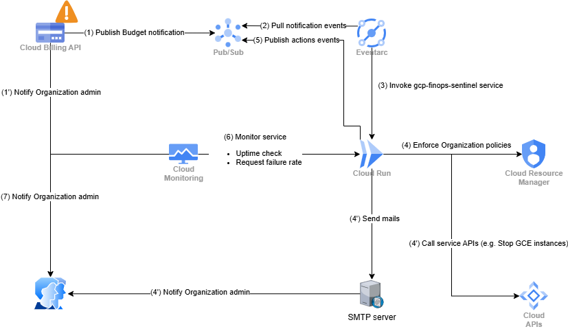

# 💸 GCP FinOps Sentinel

[](https://opensource.org/licenses/Apache-2.0)
[](https://github.com/syalioune/gcp-finops-sentinel/actions/workflows/test.yml)


**Automated GCP cost control through policy enforcement.** GCP FinOps Sentinel is an event-driven Cloud Run service that automatically enforces organization policies when budget thresholds are exceeded, helping you control cloud costs without manual intervention.

## ✨ Features

* 🚨 **Event-Driven**: Triggered automatically by GCP Budget Alerts via Pub/Sub
* 📊 **Flexible Rules Engine**: Configure multiple rules with threshold-based conditions and advanced filtering
* 🎯 **Multi-Target Support**: Apply policies to projects, folders, organizations, or discover projects by labels
* 🔒 **Policy Enforcement**: Restrict GCP services and apply organization policy constraints
* 📧 **Email Notifications**: HTML email alerts via SMTP with customizable Jinja2 templates
* 📡 **Observability**: Optional Pub/Sub event publishing for auditing and monitoring
* 🏗️ **Infrastructure as Code**: Deploy with OpenTofu using Docker container
* 🧪 **Well-Tested**: Comprehensive unit and integration test coverage
* 🐳 **Container-Based**: Deployed as a Docker container to Cloud Run for scalability
* 🔬 **Local Development**: Docker Compose environment with Pub/Sub and MailHog emulators

## 📋 Table of Contents

- [Quick Start](#-quick-start)
- [Architecture](#-architecture)
- [Installation](#-installation)
- [Configuration](#-configuration)
- [Deployment](#-deployment)
- [Development](#-development)
- [Testing](#-testing)
- [Contributing](#-contributing)
- [Documentation](#-documentation)
- [License](#-license)

## 🚀 Quick Start

### Prerequisites

* GCP Organization with billing enabled
* OpenTofu installed
* Docker (for local development)
* Python 3.13+ (for local development)

### Deploy with OpenTofu

```bash
# 1. Clone the repository
git clone https://github.com/syalioune/gcp-finops-sentinel.git
cd gcp-finops-sentinel

# 2. Configure your deployment
cd tofu
cp terraform.tfvars.example terraform.tfvars
# Edit terraform.tfvars with your GCP project, organization ID, and rules

# 3. Deploy to GCP
tofu init
tofu plan
tofu apply
```

The function will be deployed as a Cloud Run service triggered by budget alert Pub/Sub messages.

See [Tofu deployment guide](./docs/TOFU_DEPLOYMENT.md)

### Test Locally

```bash
# Start local environment with Pub/Sub emulator and MailHog
docker compose up -d

# Publish a test budget alert
export PUBSUB_EMULATOR_HOST=localhost:8681
python scripts/publish-budget-alert-event.py --cost-amount 1200 --budget-amount 1000

# View email notifications at http://localhost:8025
```

## 🏗️ Architecture

### System Overview

See [Draw.io diagram](./diagrams/)



### Components

1. **GCP Budget**: Configured with threshold rules and Pub/Sub notifications
2. **Budget Alerts Pub/Sub Topic**: Receives budget alert messages with billing account and budget ID attributes
3. **Cloud Run Service**: Containerized application that processes alerts, evaluates rules, and applies policies
4. **Rule Engine**: Evaluates budget data against configured rules with filtering capabilities
5. **Policy Engine**: Executes policy actions on GCP resources (projects, folders, organizations)
6. **Email Service**: Sends HTML email notifications via SMTP with customizable templates
7. **Org Policy Constraints**: Enforces organization-level policies (e.g., disable external IPs)
8. **Service Restrictions**: Denies specific GCP services (e.g., compute.googleapis.com)
9. **Action Events Pub/Sub Topic**: (Optional) Publishes policy action events for observability and auditing
10. **Target Resources**: Projects, folders, or organizations where policies are applied

## 📦 Installation

### System Requirements

* [Python 3.13+](https://www.python.org/downloads/)
* [Docker](https://docs.docker.com/get-docker/) and [Docker Compose](https://docs.docker.com/compose/install/)
* [OpenTofu](https://opentofu.org/)
* [GCP SDK (gcloud)](https://cloud.google.com/sdk/docs/install)
* Python IDE: [VS Code](https://code.visualstudio.com/) with Python extension recommended

### Build from Source

```bash
# Install Python dependencies
pip install -r src/requirements.txt -r src/requirements-test.txt

# Run tests
pytest tests/ -v

# Build Docker image
docker build -t gcp-finops-sentinel:latest .
```

### Pre-built Container Images

Container images are available in the Docker Hub Registry:

```bash
docker pull syalioune/gcp-finops-sentinel:latest
```

## ⚙️ Configuration

### Environment Variables

| Variable | Purpose | Default | Required |
|----------|---------|---------|----------|
| `ORGANIZATION_ID` | GCP Organization ID for policy enforcement | - | ✅ |
| `RULES_CONFIG` | Rules as JSON or YAML string | - | ✅* |
| `RULES_CONFIG_PATH` | Path to rules config file (JSON or YAML) | `/workspace/rules.json` | ✅* |
| `ACTION_EVENT_TOPIC` | Pub/Sub topic for publishing action events | - | ❌ |
| `DRY_RUN` | Enable dry-run mode (log without executing) | `false` | ❌ |
| `LOG_LEVEL` | Logging verbosity (DEBUG, INFO, WARNING, ERROR) | `INFO` | ❌ |
| `SMTP_HOST` | SMTP server hostname for email notifications | - | ❌** |
| `SMTP_PORT` | SMTP server port | `587` | ❌** |
| `SMTP_USER` | SMTP authentication username | - | ❌** |
| `SMTP_PASSWORD` | SMTP authentication password | - | ❌** |
| `SMTP_USE_TLS` | Enable TLS for SMTP connection | `true` | ❌** |
| `SMTP_FROM_EMAIL` | Sender email address | - | ❌** |
| `TEMPLATE_DIR` | Path to custom email templates directory | `../email-templates` | ❌ |

\* Either `RULES_CONFIG` or `RULES_CONFIG_PATH` must be provided
\*\* Required only if using `send_mail` action in rules

### Rules Configuration

Rules define **when** and **what** actions to take based on budget thresholds. Configuration files can be in **JSON** or **YAML** format.

See [test-data/test-rules.json](test-data/test-rules.json) and [test-data/test-rules.yaml](test-data/test-rules.yaml) for complete examples.

#### Rule Structure

```yaml
rules:
  - name: critical_budget_breach
    description: Restrict compute when budget exceeds 100%
    conditions:
      threshold_percent:
        operator: ">="
        value: 100
      billing_account_filter: "012345-6789AB-CDEF01"  # Optional
      budget_id_filter: "f47ac10b-58cc-4372-a567-0e02b2c3d479"  # Optional
    actions:
      # Restrict services on specific projects
      - type: restrict_services
        target_projects:
          - prod-web-1
          - prod-api-1
        services:
          - compute.googleapis.com
          - container.googleapis.com

      # Apply constraint on folder
      - type: apply_constraint
        target_folders:
          - "123456789012"
        constraint: compute.vmExternalIpAccess
        enforce: true

      # Target projects by labels
      - type: restrict_services
        target_labels:
          env: prod
          cost-center: engineering
        services:
          - compute.googleapis.com

      # Send email notification
      - type: send_mail
        to_emails:
          - finops-team@example.com
          - billing-alerts@example.com
        template: budget_alert
        custom_message: "Critical budget breach detected!"
```

#### Threshold Operators

The `threshold_percent` condition supports:
- **Standard operators**: `>=`, `>`, `==`, `<`, `<=`
- **Range operators**: `min` (inclusive lower bound), `max` (inclusive upper bound)
- **Array of conditions** (all must match): `[{"operator": "min", "value": 80}, {"operator": "max", "value": 89.99}]`

Examples:
```json
// Simple threshold (100% or higher)
"threshold_percent": {"operator": ">=", "value": 100}

// Range using min/max operators (80-89.99%)
"threshold_percent": [
  {"operator": "min", "value": 80},
  {"operator": "max", "value": 89.99}
]

// Open-ended range (115% or higher)
"threshold_percent": {"operator": "min", "value": 115}
```

#### Action Types

| Action Type | Description | Required Parameters |
|-------------|-------------|---------------------|
| `restrict_services` | Deny specific GCP services via org policy | `services`, targeting |
| `apply_constraint` | Apply custom org policy constraint | `constraint`, `enforce`, targeting |
| `send_mail` | Send HTML email notification via SMTP | `to_emails`, optional `template` |
| `log_only` | Log without taking action | `message`, targeting |

#### Targeting Methods

All actions (except `send_mail`) **must** specify at least one targeting method:

* `target_projects`: List of project IDs
* `target_folders`: List of folder IDs
* `target_organization`: Organization ID
* `target_labels`: Dictionary of label key-value pairs for project discovery

## 🚢 Deployment

GCP FinOps Sentinel is deployed as a **Cloud Run service** using a Docker container image. This approach provides better scalability, version control, and deployment flexibility compared to source-based deployments.

### Deployment Architecture

```
GCP Project
├── Cloud Run Service
│   ├── Container: gcp-finops-sentinel:latest
│   ├── Service Account: finops-sentinel-sa@PROJECT.iam.gserviceaccount.com
│   ├── CPU: 1, Memory: 512Mi
│   ├── Min Instances: 0, Max Instances: 10
│   └── Environment Variables (ORGANIZATION_ID, RULES_CONFIG, etc.)
│
├── Pub/Sub Topics
│   ├── budget-alerts (trigger via Eventarc)
│   └── policy-action-events (optional)
│
├── Artifact Registry
│   └── Docker repository for container images
│
└── IAM Bindings
    ├── roles/orgpolicy.policyAdmin (organization level)
    ├── roles/browser (organization level, for project discovery)
    ├── roles/pubsub.subscriber (on budget-alerts topic)
    └── roles/pubsub.publisher (on policy-action-events topic)
```

### Deploy with OpenTofu

The deployment is done via **OpenTofu**. Complete guides and examples:

* [docs/TOFU_DEPLOYMENT.md](docs/TOFU_DEPLOYMENT.md) - Comprehensive deployment guide
* [tofu](tofu) - Container-based Cloud Run deployment example
* [docs/IAM_PERMISSIONS.md](docs/IAM_PERMISSIONS.md) - Required IAM roles and permissions

#### Quick Deploy

```bash
# 1. Clone repository
git clone https://github.com/syalioune/gcp-finops-sentinel.git
cd gcp-finops-sentinel

# 2. Navigate to deployment example
cd tofu

# 3. Configure your deployment
cp terraform.tfvars.example terraform.tfvars
# Edit terraform.tfvars with your values:
#   - project_id: GCP project for deployment
#   - organization_id: Your GCP organization ID
#   - region: Deployment region (e.g., us-central1)
#   - container_image: Container image URL
#   - rules: Your budget enforcement rules

# 4. Deploy with OpenTofu
tofu init
tofu plan
tofu apply
```

#### Example OpenTofu Configuration

```hcl
resource "google_cloud_run_v2_service" "finops_sentinel" {
  name     = "gcp-finops-sentinel"
  location = var.region

  template {
    service_account = google_service_account.finops_sentinel.email

    containers {
      image = var.container_image

      env {
        name  = "ORGANIZATION_ID"
        value = var.organization_id
      }

      env {
        name  = "RULES_CONFIG"
        value = jsonencode(var.rules_config)
      }

      env {
        name  = "ACTION_EVENT_TOPIC"
        value = google_pubsub_topic.action_events.id
      }

      resources {
        limits = {
          cpu    = "1"
          memory = "512Mi"
        }
      }
    }

    scaling {
      min_instance_count = 0
      max_instance_count = 10
    }
  }
}

# Eventarc trigger for Pub/Sub
resource "google_eventarc_trigger" "budget_alerts" {
  name     = "budget-alerts-trigger"
  location = var.region

  matching_criteria {
    attribute = "type"
    value     = "google.cloud.pubsub.topic.v1.messagePublished"
  }

  destination {
    cloud_run_service {
      service = google_cloud_run_v2_service.finops_sentinel.name
      region  = var.region
    }
  }

  transport {
    pubsub {
      topic = google_pubsub_topic.budget_alerts.id
    }
  }
}
```

### Container Image Build

```bash
# Build locally
docker build -t gcp-finops-sentinel:latest .

# Tag for Artifact Registry
docker tag gcp-finops-sentinel:latest \
  ${REGION}-docker.pkg.dev/${PROJECT_ID}/finops-sentinel/gcp-finops-sentinel:latest

# Push to Artifact Registry
docker push ${REGION}-docker.pkg.dev/${PROJECT_ID}/finops-sentinel/gcp-finops-sentinel:latest
```

### IAM Setup

The service account requires these organization-level permissions:

* `roles/orgpolicy.policyAdmin` - For enforcing organization policies
* `roles/browser` - For project discovery by labels
* `roles/pubsub.publisher` - For publishing action events (optional)

See [docs/IAM_PERMISSIONS.md](docs/IAM_PERMISSIONS.md) for complete setup with OpenTofu examples.

## 🔬 Development

### Local Development with Docker Compose

The easiest way to develop and test locally:

```bash
# Start local environment (includes Pub/Sub emulator, MailHog, and function)
docker compose up -d

# View function logs
docker compose logs -f budget-function

# Test email templates (view at http://localhost:8025)
python scripts/test-email-templates.py

# Publish test budget alert
export PUBSUB_EMULATOR_HOST=localhost:8681
python scripts/publish-budget-alert-event.py

# Stop environment
docker compose down
```

**Services**:
- Budget Function: http://localhost:8080
- MailHog Web UI: http://localhost:8025 (email testing)
- Pub/Sub Emulator: localhost:8681

See [LOCAL_DEVELOPMENT.md](docs/LOCAL_DEVELOPMENT.md) for detailed local development guide.

### Run with Functions Framework

```bash
# Set environment variables
export DRY_RUN=true
export ORGANIZATION_ID=123456789012
export RULES_CONFIG_PATH=test-data/test-rules.json

# Run function locally
cd src
functions-framework --target=budget_response_handler --debug --port=8080
```

### Code Quality

```bash
# Format code
cd src
black .
isort .

# Lint code (maintain score above 8.0)
pylint *.py
```

## 🧪 Testing

### Unit Tests

```bash
# Run all unit tests
pytest tests/ -v

# Run specific test file
pytest tests/test_rule_engine.py -v

# Run with coverage report
pytest tests/ -v --cov=src --cov-report=html
# View coverage: open htmlcov/index.html
```

### Integration Tests

Integration tests verify the complete flow using Docker Compose with Pub/Sub emulator and MailHog:

```bash
# Run all tests (unit + integration)
./scripts/run-tests.sh all

# Unit tests only
./scripts/run-tests.sh unit

# Integration tests only
./scripts/run-tests.sh integration
```

### Test with Sample Events

```bash
# Start local environment
docker compose up -d

# Publish sample budget alerts
python scripts/publish-budget-alert-event.py --cost-amount 800 --budget-amount 1000   # 80%
python scripts/publish-budget-alert-event.py --cost-amount 1200 --budget-amount 1000  # 120%

# Check email notifications at http://localhost:8025
```

## 🤝 Contributing

Contributions are welcome! We appreciate bug reports, feature requests, documentation improvements, and code contributions.

### How to Contribute

1. **Fork** the repository
2. **Install dependencies**: `pip install -r src/requirements.txt -r src/requirements-test.txt`
3. **Install pre-commit hooks**: `pre-commit install && pre-commit install --hook-type commit-msg`
4. **Create a feature branch**: `git checkout -b feat/my-feature`
5. **Make changes** and ensure tests pass: `pytest tests/ -v`
6. **Format code**: `black src/ tests/ && isort src/ tests/`
7. **Lint code**: `pylint src/ tests/` (maintain score above 8.0)
8. **Commit** using [Conventional Commits](https://www.conventionalcommits.org/): `git commit -m "feat: add awesome feature"`
9. **Push** and open a Pull Request

### Code Style

* **PEP 8** compliance, line length 100 characters
* Use **Black** for formatting, **isort** for imports
* Add type hints for function parameters and returns
* Use Google-style docstrings for classes and functions
* Maintain **pylint** score above 8.0

### Commit Conventions

* `feat:` - New features
* `fix:` - Bug fixes
* `docs:` - Documentation changes
* `test:` - Test additions/updates
* `refactor:` - Code restructuring

**Detailed guidelines**: See [CONTRIBUTING.md](CONTRIBUTING.md)

## 📚 Documentation

* [Local Development Guide](docs/LOCAL_DEVELOPMENT.md) - Set up local dev environment
* [OpenTofu Deployment Guide](docs/TOFU_DEPLOYMENT.md) - Complete deployment guide
* [IAM Permissions Guide](docs/IAM_PERMISSIONS.md) - Required roles and permissions
* [Contributing Guidelines](CONTRIBUTING.md) - How to contribute
* [Code of Conduct](CODE_OF_CONDUCT.md) - Community guidelines

## 🗂️ Project Structure

```
gcp-finops-sentinel/
├── src/                                # Source code
│   ├── main.py                         # Entry point
│   ├── handler.py                      # Cloud Run handler
│   ├── budget_response_engine.py       # Policy enforcement engine
│   ├── rule_engine.py                  # Rule evaluation logic
│   ├── project_discovery.py            # Label-based project discovery
│   ├── email_service.py                # Email notification service
│   └── config.py                       # Configuration loading
│
├── tests/                              # Unit tests
├── integration-tests/                  # Integration tests
├── scripts/                            # Helper scripts
├── test-data/                          # Test configurations
├── email-templates/                    # Email templates (HTML + Jinja2)
├── docs/                               # Documentation
├── tofu/                               # OpenTofu examples
├── Dockerfile                          # Container image for Cloud Run
├── docker-compose.yml                  # Local dev environment
└── README.md                           # This file
```

## 🔒 Security

### Best Practices

* ✅ Never commit credentials or API keys
* ✅ Use Secret Manager for SMTP credentials
* ✅ Use Workload Identity Federation for keyless authentication
* ✅ Follow principle of least privilege when assigning IAM roles
* ✅ Enable VPC Service Controls for additional security
* ✅ Use dry-run mode (`DRY_RUN=true`) for testing

### Reporting Security Issues

Please report security vulnerabilities via [GitHub Security Advisories](https://github.com/syalioune/gcp-finops-sentinel/security/advisories).

## 📊 Observability

### Logging

Cloud Run automatically captures logs. View them in GCP Console:

```
resource.type="cloud_run_revision"
resource.labels.service_name="gcp-finops-sentinel"
```

Key log filters:
* `jsonPayload.action_type="restrict_services"` - Service restriction actions
* `jsonPayload.success=false` - Failed actions
* `severity>=ERROR` - Errors only

### Policy Action Events (Optional)

When `ACTION_EVENT_TOPIC` is configured, all policy actions are published to Pub/Sub:

```json
{
  "timestamp": 1234567890.123,
  "action_type": "restrict_services",
  "project_id": "my-project-123",
  "success": true,
  "organization_id": "123456789012",
  "details": {
    "constraint": "gcp.restrictServiceUsage",
    "services": ["compute.googleapis.com"],
    "error": null
  }
}
```

Use these events for:
* Real-time monitoring
* Audit trail in BigQuery
* Integration with external systems (SIEM, ticketing)

## 📝 License

This project is licensed under the **Apache License 2.0** - see the [LICENSE](LICENSE) file for details.

## 🙏 Acknowledgments

* Built with [Functions Framework](https://github.com/GoogleCloudPlatform/functions-framework-python)
* Uses [GCP Python Client Libraries](https://github.com/googleapis/google-cloud-python)
* Email templating powered by [Jinja2](https://jinja.palletsprojects.com/)
* Deployed with [OpenTofu](https://opentofu.org/)

> **Note**: This project was developed with AI assistance from [Claude](https://claude.ai) by Anthropic, serving as a development partner throughout design, implementation, testing, and documentation.

## 💬 Support

* **Bug Reports**: [GitHub Issues](https://github.com/syalioune/gcp-finops-sentinel/issues)
* **Feature Requests**: [GitHub Discussions](https://github.com/syalioune/gcp-finops-sentinel/discussions)
* **Questions**: Check [docs/](docs/) or open a discussion

## 🗺️ Roadmap

- [x] Email notifications via SMTP with HTML templating
- [x] Dynamic project discovery via labels
- [x] Folder-level and organization-level targeting
- [x] Budget and billing account filtering
- [x] Policy action event publishing
- [x] Cloud Run deployment with container images
- [ ] Support for multiple organization policies per action
- [ ] Slack/Teams webhook notifications

## 📈 Status


---

**Made with ❤️ for cloud cost optimization**

⭐ **Star this repo** if you find it useful!
